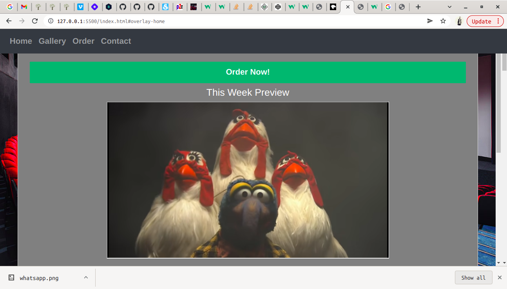

### VX Movie Studio

##### By Daniel Muthama

## Table of Content

+ [Description](#description)
+ [Installation Requirement](#Installation)
+ [Technology Used](#technology-used)
+ [Reference](#reference)
+ [Licence](#licence)
+ [Authors Info](#author-Info)

## Description

This is  a webpage that displays services offered by VX Movie Studio. This project is a website for a studio i.e., VX Movie Studio which contains a welcome, about us, services, what we do, portfolio and, a contact us section.

This is  a webpage that displays services offered by VX Movie Studio

## Installation

### Requirements

* Either a computer,phone,tablet or an Ipad

* An access to the Internet

### The Installation Process
****
Click on the link below to view the site
[https://danielmuthama.github.io/VX Movie_Studio/]
## Technology Used
* HTML - which was used to build the structure of the pages.

* CSS - which was used to style the pages incuding the left aside navigation bar

* JAVASCRIPT - which has been used for form validation and jquery

## Licence

MIT License

Copyright (c) [2022] [Daniel Soi Muthama]

Permission is hereby granted, free of charge, to any person obtaining a copy
of this software and associated documentation files (the "Software"), to deal
in the Software without restriction, including without limitation the rights
to use, copy, modify, merge, publish, distribute, sublicense, and/or sell
copies of the Software, and to permit persons to whom the Software is
furnished to do so, subject to the following conditions:

The above copyright notice and this permission notice shall be included in all
copies or substantial portions of the Software.

THE SOFTWARE IS PROVIDED "AS IS", WITHOUT WARRANTY OF ANY KIND, EXPRESS OR
IMPLIED, INCLUDING BUT NOT LIMITED TO THE WARRANTIES OF MERCHANTABILITY,
FITNESS FOR A PARTICULAR PURPOSE AND NONINFRINGEMENT. IN NO EVENT SHALL THE
AUTHORS OR COPYRIGHT HOLDERS BE LIABLE FOR ANY CLAIM, DAMAGES OR OTHER
LIABILITY, WHETHER IN AN ACTION OF CONTRACT, TORT OR OTHERWISE, ARISING FROM,
OUT OF OR IN CONNECTION WITH THE SOFTWARE OR THE USE OR OTHER DEALINGS IN THE
SOFTWARE.

## Authors Info

Linked - [Daniel Muthama](https://www.linkedin.com/in/daniel-muthama-577b211a5/)
